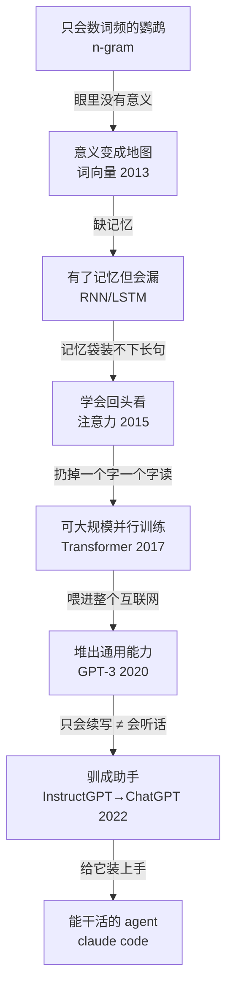

# 为什么大模型能回答问题？

你可以问它任何东西——一段报错的代码、明朝为什么亡、用李白的口气写句生日祝福——它都答得有模有样。可它从头到尾只在做一件事，机械地重复：**猜下一个字该是什么**。

猜下一个字。就这么一件事，怎么会变出像在思考的东西？

这篇就把这件怪事讲透。

## 一、剥开看，它到底在干什么

把所有花哨的说法剥掉，它的工作只有一句话：

> 给定目前为止的所有文字，算出"下一小段"每种可能的概率，挑一个接上去，再把这一长串从头算一遍，吐出再下一段。

"下一小段"在行话里叫 token——大致是一个词或半个词（英文 `unbelievable` 会被切成 `un / believ / able`，中文常一字一个）。所以更准确地说，它在"猜下一个 token"。但本质就是：**预测—接上—再预测**，循环到你喊停。

没有数据库检索，没有"先理解再作答"的开关。就是这台预测机器，一个 token 一个 token 把回答吐出来。

机制如此简单，输出却如此丰富——谜题就在这里。

## 二、为什么"猜下一个字"能逼出智能

先讲个比喻，你立刻就懂。

我给你一个"简单"任务：拿任意一本侦探小说，把**最后一句**——凶手是谁——盖住，让你填。

要填对，你得读懂整个案情、记住每个人的不在场证明、跟上侦探的每一步推理。**"猜最后一句"一句话说得清，但要做对它，你几乎得读懂整本书。**

大模型就是被这样逼出来的。它的训练是：拿人类写下的几乎所有文字，一遍遍盖住下一个 token 让它猜，猜错就挨罚、调整。而那些文字是**人**写的——背后是知识、逻辑、意图。要把人写的下一个字猜准，它就被逼着把"产生这些文字的东西"也学进去。

举个具体的。语料里反复出现这种句子：

> 一个数加 7 等于 12，这个数是几？答：5。

要稳定猜对那个"5"，靠数词频没用（换成"加 8 等于 13"，词频立刻就废）。它只能**逼自己长出一套能做这步运算的内部机制**。一道道这样的坎逼下来，加减、语法、常识、套路，全被压进了参数里。

这里还有最关键的一层，叫**压缩**。互联网的文字浩如烟海，而模型的"脑容量"（参数）是固定的，**根本背不下来**。背不下来怎么办？只能像学霸——不死记硬背，而是总结出能举一反三的规律。**一个被逼着把海量例子压进有限空间的系统，最后学到的不是一条条记忆，而是一套套规律。而规律，看起来就很像"理解"。**

所以那句话得反过来说：不是"它这么简单怎么会聪明"，而是"**要把这件简单的事做到极致，它不聪明不行**"。

## 三、它是怎么一步步长成今天这样的

今天这台机器不是一夜冒出来的。它的历史是一连串"卡住—突破"的接力，每一棒都在解上一棒的死穴。

**最早，它是只会数数的鹦鹉。** 早期语言模型（n-gram）就是统计"这几个字后面最常跟哪个字"。死穴是眼里没有意义：在它看来"狗"和"犬"是两个毫不相干的符号，而且但凡一种说法没在语料里出现过，它就傻了。

**第一步突破：让意义变成地图。** 2013 年的词向量（word2vec）不再把词当孤立符号，而是给每个词一个坐标，让意思相近的词落在地图上相近的位置——近到"国王 − 男人 + 女人"算出的坐标，正好落在"王后"附近。意义第一次有了几何。

**第二步：给它记忆，但记忆会漏。** 接下来的模型（RNN/LSTM）能顺着句子一个字一个字读、边读边记。但它把整句话硬塞进一个固定大小的"记忆袋"，长句一来就挤丢了，前文记不住。

**第三步：教它回头看。** 2015 年的"注意力"机制让模型在写每个字时，能回头扫一遍前文所有位置，自己决定该重点看哪几个词。记忆袋的瓶颈被打掉了。

**第四步，最关键的一跃：2017 年的 Transformer。** 它干脆把"一个字一个字顺着读"整个扔了，纯靠注意力搭起来。好处是**能极大规模并行训练**——这才让"把整个互联网喂给它"在算力上变得可能。今天所有大模型都长在这个架构上。

**第五步：堆规模，堆出像质变的能力。** 架构就位后，研究者疯狂加大数据、参数、算力。到 2020 年的 GPT-3（1750 亿参数），出现惊人现象：你在问题里给它几个例子，它不用重新训练就能照葫芦画瓢做新任务。（要泼盆冷水：不少"能力突然涌现"的说法，后来被发现有一部分是评测指标制造的错觉，规模带来的提升其实大体平滑。）

**第六步：把野生的预测机器驯成助手。** 这时的 GPT-3 还只会"续写"、不会"听话"——你问它问题，它可能反手给你列五个类似的问题（因为语料里问题常成堆出现）。2022 年的 InstructGPT 用人类反馈把它调教成会遵循指令、有问必答，这一步催生了 ChatGPT。

**第七步：给它装上手。** 再往后，模型有了调用工具、检索资料、看图的能力，并被装进"行动—看结果—再行动"的循环里——这就是你正在用的 claude code 这类 agent。

## 四、那它为什么会一本正经地胡说？

理解了上面，幻觉就不神秘了，甚至是必然的。

这台机器从设计上**就没有一个分辨"真"和"听起来真"的零件**。它的整个训练目标是"生成像样的、顺畅的下一段文字"，从来不是"生成真的文字"。所以当它其实不知道答案时，它**不会有"我不知道"的感觉**——只会平滑地、自信地，给你编一段听起来很对的。

为什么偏偏"自信地编"，而不是老实说不知道？两层原因：

一层是**统计上躲不掉**。当"对的说法"和"听起来对但其实错的说法"在数据里难以区分时，犯错就是数学上的必然，再完美的训练也消不掉。

另一层是**我们把它教成了这样**。我们训练和考核它的方式，像极了一场"蒙对得分、留白零分"的考试——于是它学会：与其交白卷，不如自信地赌一个。它不是坏，是被打分规则逼成了一个宁可瞎猜也不肯认怂的考生。

所以下次它一本正经胡说时，你该想到：这不是它"坏了"，而是它**本来就这么工作**——一台没有真假传感器、又被训练得不肯认怂的预测机器。

## 五、还没人说得清的部分

讲到这儿要老实交代一句：上面说它"学到了规律"，**那它到底算不算真的"懂"？**

这件事目前没有定论，而且是当前最前沿的争论。

一边的证据很惊人：有人训练了一个模型，只让它预测黑白棋的下一步走法，从没告诉它棋盘长什么样。结果拆开它的"大脑"一看——**它自己在内部画出了一张棋盘的状态图**。这说明"只为预测下一步"也能逼出对世界的某种内部建模，不只是表面拼接。

另一边的批评同样有力：它可能只是一只极其高明的"随机鹦鹉"，把人类语言的统计规律模仿得惟妙惟肖，却谈不上任何真正的理解。

诚实的说法是：**它学到的东西，远比"统计"这个词暗示的丰富；但这是否等同于人类意义上的"理解"，我们还不知道。** 这恰恰是这个领域最迷人的地方。

---

## 延伸阅读

挑了几篇真正的源头，想往下挖可以读：

- 意义变成地图：[Efficient Estimation of Word Representations（Mikolov 等, 2013）](https://arxiv.org/abs/1301.3781)
- 改变一切的架构：[Attention Is All You Need（Vaswani 等, 2017）](https://arxiv.org/abs/1706.03762)
- 规模的力量：[Language Models are Few-Shot Learners / GPT-3（Brown 等, 2020）](https://arxiv.org/abs/2005.14165)
- 驯成助手：[Training LMs to follow instructions / InstructGPT（Ouyang 等, 2022）](https://arxiv.org/abs/2203.02155)
- "涌现"是不是错觉：[Are Emergent Abilities a Mirage?（Schaeffer 等, 2023）](https://arxiv.org/abs/2304.15004)
- 它到底懂不懂：[Othello-GPT 内部世界表征（Li 等, 2023）](https://arxiv.org/abs/2210.13382) ｜ 反方：["随机鹦鹉"（Bender 等, 2021）](https://dl.acm.org/doi/10.1145/3442188.3445922)
- 为什么会胡说：[Why Language Models Hallucinate（Kalai 等, 2025）](https://arxiv.org/abs/2509.04664)
