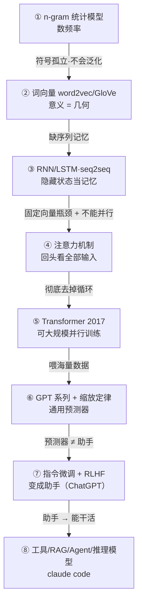

# Q1：大模型为什么能回答问题？

> 收窄后的问题：**"只是预测下一个 token"这么简单的目标，为什么能产生看起来像理解和推理的行为？**
>
> 第一阶段目标是"观全貌 + 演进脉络"，不深拆 Transformer 架构内部。

**标注约定**：`✅` 已被验证的事实（带出处） · `🔶` 作者/Claude 的推断 · `❓` 当前尚无定论的前沿争议。

---

## TL;DR

你被"简单"骗了——**简单的是目标，不是达成目标所需的能力**。要把"人写的海量文本里下一个 token"预测到极准，一个固定大小的网络背不下来，只能被逼着压缩出能泛化的内部结构（语法、事实、推理套路）。所以"像在推理"是"把预测做到极致"的副产物。

至于这套结构算不算"真理解"——❓ 没有定论。而它会幻觉，是因为这套机制**没有区分"真"和"听起来真"的装置**，再加上训练/评测**奖励自信瞎猜、惩罚认怂**。

---

## 一、拆掉三个前提

常见的一句话总结是："大模型就是概率预测下一个词 → 本质是统计概率模型 → 所以会编造。" 这句话捆了三个独立命题，可靠程度并不一样。

### 前提① "预测下一个词"
- ✅ **机制上准确**，但要精确两点：
  - 不是"词"而是 **token**（子词片段：英文 `unbelievable` 可能切成 `un/believ/able`，中文常一字一 token）。
  - 推理时它做的事：给定前面所有 token，算出下一个 token 的**概率分布**，按分布挑一个，接上去，再算下一个——循环。这叫**自回归**。
- 🔶 **需要修正**："预测下一个 token"只精确描述了**预训练**和**推理机制**。你对话的助手在预训练之后还经过指令微调和 RLHF（用人类偏好二次塑形），它已经**不是纯粹按训练语料统计去续写**了。这个区别在 Q3 会变成关键。

### 前提② "本质是统计概率模型"
- ✅ 它确实输出概率分布（这点前提①已说明，不赘述）。
- 🔶 **但"统计概率"这个词会误导**。它让人以为像查频率表、像 n-gram 那样浅。真相是：让一个**固定大小**的网络把整个互联网文本的"下一个 token"都预测准，**它根本背不下来**，只能被逼着**压缩**——找出能泛化的规律。所以"统计"是表象，底下是**被压缩压出来的结构**。
- ❓ **这是真有争议的前沿**：这些内部结构算不算"理解"/"世界模型"？
  - 一派（"随机鹦鹉"，Bender 等 2021）认为它只是高级模式拼接，没有理解。
  - 另一派有实验证据：只训练"预测黑白棋下一步"的小模型，内部**自发表征出了真实棋盘状态**（Othello-GPT，Kenneth Li 等 2023；后续 Neel Nanda 发现该表征是线性、可因果干预的）。
  - **诚实立场** 🔶：没有定论。倾向认为"它学到了远比'统计'丰富的结构，但是否等于人类意义的'理解'无法下定论"。

### 前提③ "所以会幻觉、会编造"
"因为统计 → 所以编造"听着顺，但真实成因是**两层，都是直接原因**：

1. **统计根源（为什么至少会有错）** ✅：幻觉本质上是**统计必然**。类比监督学习里的误分类——**当"有效输出 vs 无效输出"在统计上难以区分时，生成错误就不可避免**，哪怕训练完美。（Kalai 等 2025）
2. **激励根源（为什么错得自信、不肯认怂）** ✅：标准训练和评测**奖励瞎猜、惩罚留白**。模型被优化成"好的应试者"，蒙一个比说"不知道"得分高。RLHF 还会加重这点（谄媚 / sycophancy，Sharma 等 2023）。

> **结论**：统计解释"为什么必然有错"，激励解释"为什么错得自信"。"统计→会错"这半对了，缺的是"激励→不肯认怂"那半。

---

## 二、核心机制：为什么简单目标能出复杂行为

打个比方：把任意一篇侦探小说的最后一句盖住让你预测。要预测准，你被迫读懂整个推理链、记住谁有不在场证明、理解作者叙事习惯。**"预测最后一句"一句话说得清，但做好它需要近乎读懂全书的能力。**

大模型就是被这个机制逼出来的：

- 训练语料是**人写的**，背后有知识、意图、推理。要把下一个 token 预测准，模型被迫**内化产生这些文字的规律**。
- 语料里大量出现 `Q: 一个数加 7 等于 12，这个数是几？ A: 5`，要把那个 `5` 预测准，光靠词频不行，**得逼出能做这步运算的内部机制**。
- ✅ 这就是为什么**思维链**（chain-of-thought，让它"一步步想"，Wei 等 2022）有效：先生成中间推理 token，等于给它更多"工作空间"去条件化最终答案。
- 🔶 **规模**（数据 × 参数 × 算力）是把这套从玩具变成今天这样的关键。但"涌现新能力"的说法 ❓ 有争议——Schaeffer 等（NeurIPS 2023）证明不少"突然涌现"是**评测指标选择**造成的错觉，换平滑指标就变回连续可预测。

**一句话**：它能"像在推理"，是因为"把海量人类文本的下一个 token 预测到极准"这个看似简单的目标，在足够规模下逼出了一套**能复现人类文字背后规律的内部机制**。它算不算"真推理"是 ❓ 没定论的前沿。

---

## 三、演进脉络（五幕观全貌）

一句话挂住全局：**这条脉络前四分之三都在回答"怎么把'预测下一个 token'做得更好"；只有最后一段，问题才变成"怎么把预测器变成能用的助手、能干活的 agent"。**

每一幕 = 一个卡脖子的瓶颈 + 它怎么被打破：

**第一幕｜怎么表示"意义"**
- ✅ n-gram（2000 年代主流）：数"这几个词后面最常跟哪个词"，纯频率。死穴 🔶：数据稀疏（多数组合从没出现，概率为 0）、不会举一反三（"狗"和"犬"是无关符号）、记不住长上下文。
- ✅ 突破：词向量（word2vec，Mikolov 等 2013；GloVe 2014）。给每个词学稠密向量，相似上下文的词拿相似向量。`国王 - 男人 + 女人 ≈ 王后`——意义第一次变成几何关系，能泛化。

**第二幕｜怎么处理"上下文 / 长程依赖"**
- ✅ RNN/LSTM（LSTM：Hochreiter & Schmidhuber 1997）、seq2seq（Sutskever 等 2014）：逐 token 处理、维护隐藏状态当记忆。死穴 🔶：整句被压进一个固定向量（瓶颈）、必须顺序算不能并行、长依赖仍记不住。
- ✅ 突破：注意力机制（Bahdanau 等 2015）。让解码器每一步回头看输入所有位置、自己加权该重点看哪几个词。

**第三幕｜把循环彻底扔掉**
- ✅ Transformer（Vaswani 等 2017，《Attention is All You Need》）：删掉循环，只用注意力 + 前馈层。意义 🔶（按边界不拆内部）：**完全可并行**（能在海量数据上高效训练）+ 直接建模长程依赖。**正是"可大规模并行训练"让后面的规模化成为可能。**

**第四幕｜靠规模催熟**
- ✅ GPT-1（2018）→ GPT-2（2019）→ GPT-3（Brown 等 2020，1750 亿参数）。GPT-3 展现**上下文学习 / 少样本**：prompt 里给几个例子、不改权重就能做新任务。
- ✅ 缩放定律（Kaplan 等 2020；Chinchilla / Hoffmann 等 2022）：性能随"参数×数据×算力"**可预测平滑**提升；Chinchilla 指出多数模型训练不足、数据应与参数同步放大。
- 🔶 挂上一节的 ❓：规模带来的提升大体平滑可预测，"质变"叙事要打折扣。

**第五幕｜把预测器变成助手（范式转折）**
- 此时手里的 GPT-3 **只会续写、不是会听话的助手**（你问它问题，它可能反过来给你列五个类似问题）。
- ✅ 指令微调 + RLHF（InstructGPT，Ouyang 等 2022）：先用"指令-示范"微调，再用人类偏好训练奖励模型、用强化学习把模型往人喜欢的回答拉。这把 GPT-3 变成 **ChatGPT（2022.11）**。
- 🔶 **这是 Q3 的引线**：助手"看起来可靠"，一部分可靠性不来自预训练的"统计"，而来自这层后天对齐——但这层也会引入新毛病（谄媚、自信瞎猜）。
- ✅ 再往后（2023→今）：工具 / 检索（RAG，Lewis 等 2020）/ 多模态 / Agent 循环（claude code 在这层）+ 推理模型（o1 类，2024 起，用 RL 专门训练"先长思考再作答"，接上思维链）。**这是 Q2 的引线。**

---

## 四、贯穿主线：不确定性

> n-gram 数频率 → 词向量给意义、序列模型给记忆 → 注意力打破瓶颈、Transformer 让规模化可能 → 规模化催熟通用预测器 → 对齐把预测器变成助手 → 工具与 agent 让助手能干活。

"不确定性"贯穿始终：它是预测机制的固有产物（**Q1**），工程要在它之上搭楼（**Q2**），还要反过来驯服它（**Q3**）。三个问题是同一个本质的三个面。

---

## 五、还没闭环的问题（诚实留白）

- ❓ 模型内部结构到底算不算"理解 / 世界模型"？Othello-GPT 这类证据支持"有内部表征"，但能否推广到通用语言模型、是否等于人类意义的理解，无定论。
- ❓ "涌现"争议未完全收束：指标错觉能解释多少、是否还有真·相变成分，仍在研究。
- 🔶 本文是"观全貌"层级，**Transformer 内部（注意力如何算、为什么有效）没拆**——留给第二阶段。
- 🔶 RLHF 如何具体改变模型行为、可靠性到底分布在"模型 / 流程 / 人"哪一层——留给 Q3。

---

## 出处

**已联网核实（2026-05）**：
- [On the Dangers of Stochastic Parrots（FAccT 2021）](https://dl.acm.org/doi/10.1145/3442188.3445922)
- [Emergent World Representations / Othello-GPT（arXiv 2210.13382）](https://arxiv.org/abs/2210.13382) · [Neel Nanda 线性表征后续](https://www.neelnanda.io/mechanistic-interpretability/othello)
- [Are Emergent Abilities a Mirage?（arXiv 2304.15004，NeurIPS 2023）](https://arxiv.org/abs/2304.15004)
- [Why Language Models Hallucinate（arXiv 2509.04664）](https://arxiv.org/abs/2509.04664) · [OpenAI 官方说明](https://openai.com/index/why-language-models-hallucinate/)
- [Chain-of-Thought Prompting（arXiv 2201.11903）](https://arxiv.org/abs/2201.11903)
- [Towards Understanding Sycophancy（arXiv 2310.13548）](https://arxiv.org/abs/2310.13548)

**历史里程碑（学界公认文献，链接待按需补全）**：
- word2vec — Mikolov 等，2013；GloVe — Pennington 等，2014
- LSTM — Hochreiter & Schmidhuber，1997；seq2seq — Sutskever 等，2014
- 注意力 — Bahdanau 等，2015
- Transformer — Vaswani 等，2017，《Attention is All You Need》
- GPT-3 — Brown 等，2020；缩放定律 — Kaplan 等，2020；Chinchilla — Hoffmann 等，2022
- InstructGPT — Ouyang 等，2022；RAG — Lewis 等，2020
